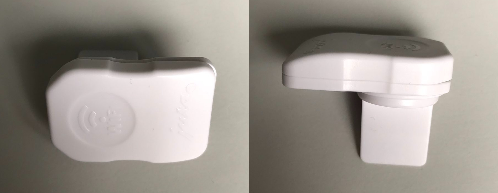
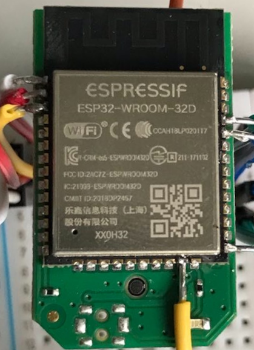

# JURA WiFi Protocol
`C++` JURA WiFi protocol implementation for controlling a JURA coffee maker over a WiFi connection.

**Currently still work in progress since I do not own a compatible JURA coffee maker for the WiFi Connect dongle.**

For a device to be able to connect to an JURA coffee maker via WiFi, a [WiFi Connect](https://uk.jura.com/en/homeproducts/accessories/WiFi-Connect-24160) dongle is required.

## Dumping the Firmware
